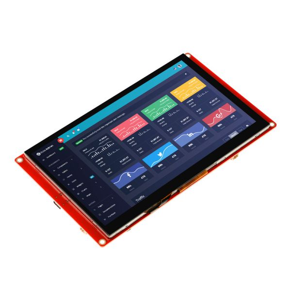

# coffee-driver

ESP-IDF 기반 Elecrow CrowPanel 드라이버 라이브러리

ESP-IDF-based Elecrow CrowPanel driver library


## Display

본 드라이버 라이브러리는 다음 하드웨어를 대상으로 합니다.

This driver library targets the following hardware:

- [**Elecrow - CrowPanel 7.0" -HMI ESP32 Display 800x480 RGB TFT LCD Touch Screen Compatible with Arduino/LVGL/ PlatformIO/Micropython-Without Acrylic Case**](https://www.elecrow.com/esp32-display-7-inch-hmi-display-rgb-tft-lcd-touch-screen-support-lvgl.html)

  

    - Main Processor: ESP32-S3-WROOM-1-N4R8

    - Resolution: 800*480

    - Flash: 4MB

    - PSRAM: 8MB

    - Touch Type: Capacitive Touch Screen

    - Display Type: TN Panel

    - Screen: TFT-LCD Screen

    - Display driver: EK9716BD3 & EK73002ACGB

    - External power supply: DC5V-2A

    - Interface: 2 * UART0, 2 * GPIO, 2 * I2C, 1 * Battery

    - Button: BOOT Button and Reset Button

    - Active Area: 153.84*85.63 mm(W * H)

    - Working Temperature: -20°C ~ 70°C

    - Storage Temperature: -30°C ~ 80°C


## How to use

1. [`src`](./src/) 디렉토리의 이름을 `coffee-driver`로 변경하여 ESP-IDF 프로젝트 디렉토리 내 `component` 디렉토리에 추가합니다.

   Rename the [`src`](./src/) directory to `coffee-driver` and add it to the `component` directory inside your ESP-IDF project directory.

2. 메인 디렉토리의 루트 CMakeLists에 다음과 같이 컴포넌트를 추가합니다.

   Add the component to the root CMakeLists in your main directory as follows:

   ```CMakeLists
   idf_component_register(SRCS "main.cpp"
                           INCLUDE_DIRS "."
                           REQUIRES arduino-esp32 coffee-driver)

   ```

3. 메인 소스에서 다음과 같이 [`driver.hpp`](./driver.hpp)를 통해 드라이버를 초기화합니다.

   In the main source, initialize the driver via [`driver.hpp`](./driver.hpp) like this:

   ```C++
   #include <Arduino.h>

   #include <driver.hpp>

   #define COFFEE_BAUD_RATE 115200

   extern "C" void app_main(void)
   {
       initArudino();
       Serial.begin((unsigned long) COFFEE_BAUD_RATE);

       coffee::init_driver();

       // ...
   }

   ```


## Dependencies

이 라이브러리를 사용하려면 다음 라이브러리들이 포함되어 있어야 합니다.

The following libraries must be included to use this library.

1. **arduino-esp32**

   Arduino core for the ESP32

   License: GNU Lesser General Public License Version 2.1

   https://github.com/espressif/arduino-esp32

2. **gt911-arduino**

   Arduino library for GT911

   License: Apache License Version 2.0

   https://github.com/TAMCTec/gt911-arduino

3. **LovyanGFX**

   SPI LCD graphics library for ESP32 (ESP-IDF/ArduinoESP32) / ESP8266 (ArduinoESP8266) / SAMD51(Seeed ArduinoSAMD51)

   License: FreeBSD License

   Includes: Adafruit_ILI9341(MIT License), Adafruit_GFX(BSD License), TFT_eSPI(FreeBSD License)
   https://github.com/lovyan03/LovyanGFX

4. **lvgl**

   Embedded graphics library to create beautiful UIs for any MCU, MPU and display type.

   License: MIT License

   https://github.com/lvgl/lvgl

5. **PCA9557**

   Arduino library for PCA9557 I2C 8-bit IO Expander

   License: MIT License

   https://github.com/wgrs33/PCA9557
